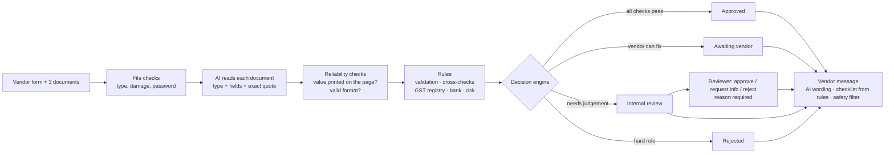

# Vendor Onboarding — AI-assisted, rules-decided

A working vendor onboarding process for Indian vendors. A vendor's submission (form + GST certificate, PAN card,
cancelled cheque) goes in; a decision comes out — **Approved**, **Pending** (awaiting the vendor, or in internal
review) or **Rejected** — with every check, its evidence, and the message sent to the vendor visible.

**The one design rule:** the AI *reads* documents and *words* messages; deterministic rules make every decision;
a person decides what the rules can't.

> All entities and documents are fictitious specimens. GST registry and bank verification are simulated providers.

## What happens to a submission



Ten stages run in the background and are shown live; every step is recorded in an append-only audit trail.

| Stage | What happens | AI? |
|---|---|---|
| Submission received | Files stored by content hash | — |
| Checking completeness | 14 required fields, 3 required documents | — |
| Reading documents | Each document identified and its fields extracted, with the exact quote they came from | ✅ |
| Checking what we read | File usable? Right document? Readable? Each key value really printed on the page and well-formed? | — |
| Validating details | GSTIN check digit, PAN structure, IFSC, account number | — |
| Cross-checking | Form vs documents vs each other: names, GSTIN↔PAN, GSTIN state↔address, PAN type↔business type, bank proof | — |
| Verifying with GST registry and bank | Registration active? Bank account exists, and whose name is it in? *(simulated providers)* | — |
| Risk screening | Debarred list, existing vendors, bank account shared with another vendor, earlier rejected application | — |
| Deciding | Fixed precedence: Reject > Review > Vendor fix > Approve; anything that didn't run fails closed to review | — |
| Notifying | Review queue and the vendor's message | ✅ wording only |

## Demo cases

| Case | Scenario | Outcome | Why |
|---|---|---|---|
| **H1** | Clean vendor; PAN card is a scanned image; bank returns "PVT LTD" | Approved | Name standardisation, not fuzzy matching |
| **H2** | Clean first-time vendor (not seeded) | Approved | For a live approval from the form |
| **E1** | GSTIN valid, but it belongs to a different PAN | Internal review | Valid check digit ⇒ not a typo ⇒ another entity's registration |
| **E2** | Bank account belongs to an individual | Internal review — vendor isn't told why | Classic payment-diversion pattern |
| **E3** | Invoice uploaded as the cheque; GSTIN from the wrong state | Awaiting vendor (2 specific asks) | Honest mistakes the vendor can fix |
| **E3R** | E3's corrected resubmission | Approved (version 2 of E3) | The vendor loop closes |
| **E4** | PAN on the debarred list | Rejected — generic message | The only hard reject |
| **E5** | Existing vendor with new bank details | Internal review | Bank change on an existing vendor is a top fraud vector |

Six cases (H1, E1–E5) are pre-loaded as **seeded samples** (labelled; results derived from known data, not
executed) so the dashboard is never empty. **Replay** runs any of them live; **New vendor → Load sample** submits one.

## Key decisions

- **AI reads, rules decide.** The model returns facts with verbatim quotes, extracted *blind* (it never sees the
  form). Every decision comes from a versioned rule catalog ([RULES.md](RULES.md)).
- **AI output is checked, not trusted.** Strict JSON schema (shape), grounding against the PDF text layer and format
  checks (correctness; this also catches misreads on scans). An unreliable read goes to a person, not to the vendor.
- **Approve only on positive evidence; fail closed.** An outage, timeout, crash or interrupted run ends in internal
  review — never approval.
- **No fuzzy name matching.** Explicit standardisation tiers ("Private Limited" = "Pvt Ltd", trade name on the GST
  certificate); a near-match in payments is a risk signal, not a rounding error.
- **What the vendor is told depends on why.** Fixable items are listed exactly; fraud signals and list names are never
  disclosed.
- **One open case per vendor.** Replay = rerun the same data; Resubmit = correct the same application (new version);
  Reapply = new application after rejection (new linked case, always reviewed by a person).
- **A reviewer can overrule a judgement, not missing evidence.** Approve is disabled when checks didn't run or the
  vendor still owes items; every action needs a reason and is audited.

Full reasoning: [ARCHITECTURE.md](ARCHITECTURE.md) · [RULES.md](RULES.md) · [ASSUMPTIONS.md](ASSUMPTIONS.md)

## Evidence it works — [RELIABILITY.md](RELIABILITY.md)

- **70/70** live runs reach the expected decision; **0** key-field misreads.
- Invalid key, model timeout, server killed mid-run, damaged / `.docx` / password-protected / oversized files — all
  fail closed or go back to the vendor with the exact fix.
- AI tail latency measured and halved (worst 34.6 s → 17.6 s) with hedged requests.
- 300+ automated tests; extraction model chosen by benchmark against labelled ground truth.

## Stack

FastAPI · SQLite (SQLAlchemy) · OpenAI `gpt-4.1` (PDF input, strict structured output) · React + Vite + TypeScript +
Tailwind · one Docker container on Render (FastAPI serves the built app).

## Run locally

```bash
cd backend
uv venv --python 3.12 .venv && uv pip install --python .venv/bin/python -r requirements-dev.txt
echo "OPENAI_API_KEY=sk-..." > .env            # git-ignored
cd ../frontend && npm install && npm run build && cd ../backend
.venv/bin/uvicorn app.main:app --reload        # http://localhost:8000
```

Tests: `.venv/bin/python -m pytest -q` (offline) · `.venv/bin/python -m pytest -m live` (real model) ·
`.venv/bin/python -m scripts.run_golden_live --runs 10 --workers 1` (stability).
Frontend with hot reload: `cd frontend && npm run dev` (http://localhost:5173, API proxied).

### Configuration

| Variable | Default | Purpose |
|---|---|---|
| `OPENAI_API_KEY` | — | Required for live document reading and AI-worded messages |
| `OPENAI_MODEL` | `gpt-4.1` | Extraction model (chosen by `scripts/benchmark_extraction.py`) |
| `APP_PASSCODE` | — | If set, the whole API requires it (always set in production) |
| `OPENAI_HEDGE_AFTER_S` | `10` | Send one backup request for a slow document read (0 = off) |
| `EXTRACTION_CACHE` | `on` | Reuse AI reads of identical files (Replay always reads fresh) |
| `MESSAGES_AI` | `on` | AI wording for vendor messages (templates otherwise) |
| `MOCK_LATENCY_MS` | `400` | Simulated provider round-trip, labelled in the UI |
| `SEED_DEMO` / `DEMO_RESET` | `on` | Seed demo cases on an empty database / allow the dashboard's Reset demo |

## Limitations (stated, not hidden)

GST registry and bank verification are simulated behind real interfaces; the vendor master is static; delivery of
vendor messages is simulated; a shared passcode instead of user accounts; SQLite and a background thread instead of
Postgres and a job queue; synthetic documents — accuracy on messy real-world scans would need a labelled set of real
documents. Details and production equivalents: [ASSUMPTIONS.md](ASSUMPTIONS.md).

## What I'd build next

1. Real providers: GST portal / GSP lookup and a penny-drop API (only `app/adapters/` changes).
2. Benchmark extraction on real vendor documents; add a second model as fallback.
3. Approval writes to the ERP vendor master; vendor-facing portal and real email; reminders for unanswered requests.
4. User accounts and roles (reviewer vs. compliance), and a compliance-only override for hard rejects.
5. Postgres + a persistent job queue; ongoing monitoring (re-screen approved vendors when the debarred list changes).

## Repository

```
backend/   FastAPI app — rules/ (decision core), llm/ (OpenAI), documents/ (file checks, grounding),
           pipeline/ (runner, review, seed), messages/, db/, api/ · data/ (reference data, sample PDFs) · tests/ · scripts/
frontend/  React app — pages/ (dashboard, new vendor, live run, case, review queue, outbox) · components/
DEMO.md    live demo script, rehearsal checklist, fallbacks
VIDEO.md   5-minute video script
```
